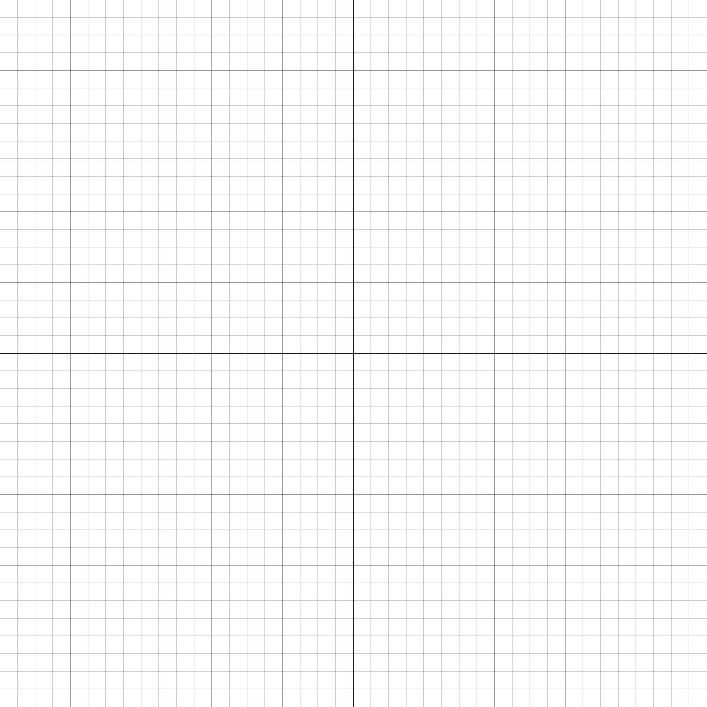

## Math 152 Learning Target Quiz 1
February 19, 2021

\vspace{0.35in}

Name: __________________________________________________________________________________

**Instructions:** Read the following instructions carefully.

- You do not need to complete every question. Choose the learning targets that are most important for you and focus on those.
- **You must show ALL of your work in order to earn full credit on any of the learning targets.** 
-  You may use any calculator you wish, so long as it does not have communications abilities (e.g., iPods, iPads, smartphones, laptops, etc.) or symbolic manipulation capabilities (e.g., TI-89).
- You may not use any notes, notecards, books, formula sheets, etc.
- Feel free to ask any questions you want -- especially if instructions are unclear, or if you want advice about which learning targets to attempt.

\begin{table}[htp] 
\begin{center} 
\def\arraystretch{2} 
\begin{tabular}{|c|c|}  \hline
\textbf{Learning Target} & \textbf{Assessment}\\\hline
1 & \\\hline
2 & \\\hline
3 & \\\hline
4 & \\\hline
5 & \\\hline
6 & \\\hline
7 & \\\hline
8 & \\\hline
9 & \\\hline
\end{tabular}
\end{center} 
\end{table}

\newpage

### Given information about a function (either a table of data or a graph), answer questions about its average and/or instantaneous rates of change. 

1. For the (blue) graph $y = f(x)$, arrange the following numbers from smallest to largest, and explain your thinking.

    * The slope of the graph at $A$
    * $f'(x)$ at $B$
    * The slope of the tangent line at $C$
    * The slope of the line $AB$
    * The number 0
    * The number 1

**Note:** The dashed line is the line $y = x$.

\begin{center}
		\includegraphics[width=3in]{img/ad.png}
	\end{center}

\newpage

### Sketch a graph that has specific behaviors at indicated points and intervals.

2. Sketch the graph of a function $f$ for which $f(0)=0$; $f'(x) > 0$ for $1 < x < 3$; $f'(x) < 0$ for $x < 1$ and $x > 3$; $f'(x) = 0$ at $x = 1$ and $x = 3$.

**Make sure to label your grid with an appropriate scale!**

\newpage

### Given the graph of a function, answer questions about the function, its derivative, and its second derivative.

3. Consider the graph below. At which of the marked values of $x$ is

	a. $f(x)$ greatest?
	b. $f(x)$ least?
	c. $f'(x)$ greatest?
	d. $f'(x)$ least?
	e. $f''(x)$ greatest?
	f. $f''(x)$ least?
	
**Note that there may be more than one answer.** You should clearly explain why your identified point satisfies the stated condition.

\begin{center}   
	\includegraphics[width=5in]{./img/lt03.png}  
\end{center}

\newpage

### Use the limit definition to find the derivative function.

4. Recall that $f'(x) = \lim\limits_{h\to 0} \frac{f(x+h)-f(x)}{h}$. Use the limit definition to calculate the derivative of $f(x) = -4x+17$.

\newpage

### Use the central difference and other estimation techniques to answer questions about applications of the derivative.

5. The temperature, $H$, in degrees Fahrenheit, of a cup of coffee placed on the kitchen counter is given by $H = f(t)$, where $t$ is in minutes since the coffee was put on the counter.

	a. Estimate the temperature at $t=35$ minutes.
	
	b. What are the units of $f'(20)$. What is the practical meaning in terms of the temperature of the coffee?

\begin{table}[htp]
\centering
\begin{tabular}{lccccccc}  \hline
$t$ &  0 & 10 & 20 & 30 & 40 & 50 & 60 \\
$H$  & 185 & 142 & 115 & 100 & 89 & 84 & 80 \\\hline
\end{tabular}
\end{table}

\newpage

### Given the graph of the derivative, answer questions about the function, the first derivative, and the second derivative.

6. Consider the graph of a **derivative** $f'(x)$ below.

	a. At what $x$-value does $f(x)$ change from increasing to decreasing? Explain.
	b. On what interval is $f(x)$ decreasing? Explain.
	c. On what interval is $f(x)$ increasing? Explain.
	
\begin{center}   
	\includegraphics[width=3in]{./img/lt06.png}  
\end{center}

\newpage

### Given the graph of a function, determine the values of indicated limits.

7. Consider the function $f(x)$ below, and calculate the indicated limits. If the limit does not exist, explain why.

	a. $\lim\limits_{x\to 0} f(x)$
	
	
	b. $\lim\limits_{x\to 2} f(x)$
	
	
	c. $\lim\limits_{x\to 3} f(x)$
	
	
	
\begin{center}   
	\includegraphics[width=3in]{./img/lt07.png}  
\end{center}

\newpage

### Given the graph of a function, determine the x-values where the function is not continuous and the points where it is not differentiable.

8. 

\newpage

### Find a local linearization, use it to estimate the function at a nearby point, and answer questions about the accuracy of that estimate.

9. Given $f(x) = \sqrt[3]{x}$, it is known that $f'(x) = \frac{1}{3\sqrt[3]{x^2}}$.

	a. Calculate the local linearization $L(x)$ at $a=8$.
	
	b. Use your answer from part (a) to estimate $\sqrt[3]{8.1}$. 