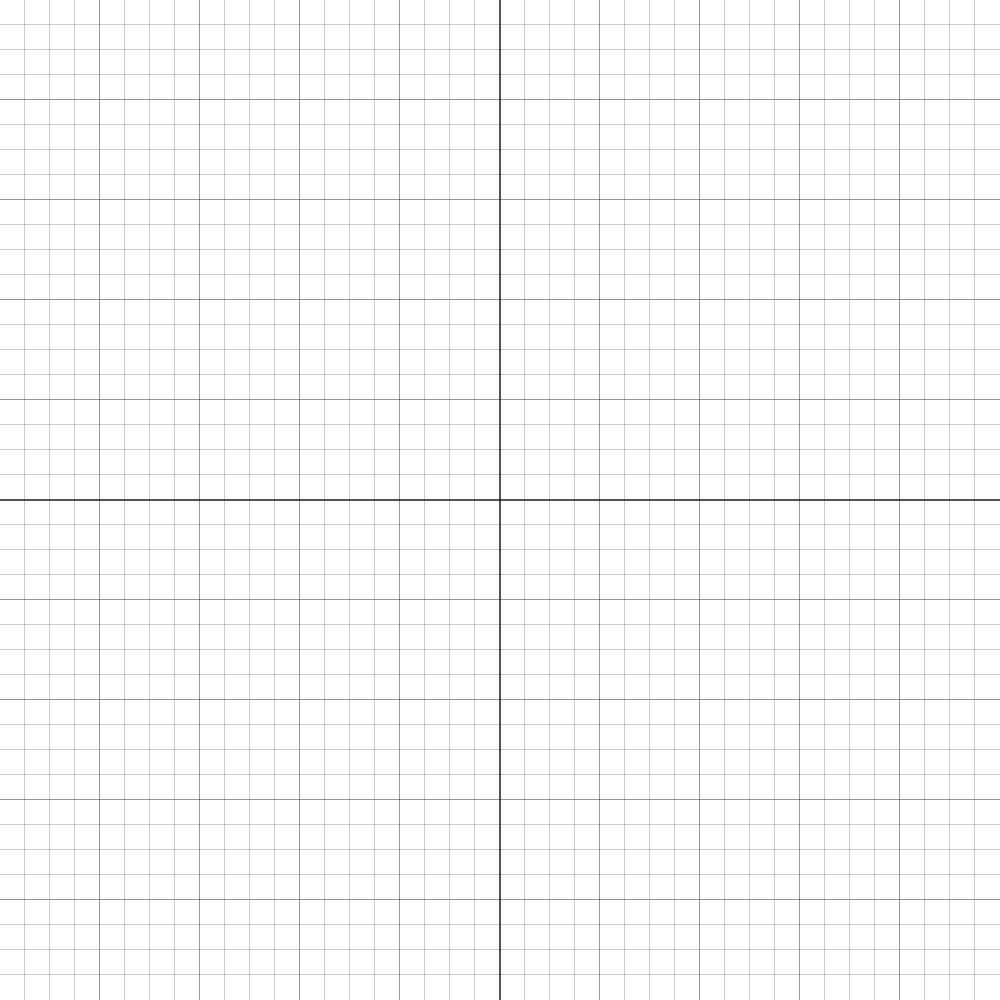

## Math 152 Learning Target Quiz 2
February 26, 2021

\vspace{0.35in}

Name: __________________________________________________________________________________

**Instructions:** Read the following instructions carefully.

- You do not need to complete every question. Choose the learning targets that are most important for you and focus on those.
- **You must show ALL of your work in order to earn full credit on any of the learning targets.** 
-  You may use any calculator you wish, so long as it does not have communications abilities (e.g., iPods, iPads, smartphones, laptops, etc.) or symbolic manipulation capabilities (e.g., TI-89).
- You may not use any notes, notecards, books, formula sheets, etc.
- Feel free to ask any questions you want -- especially if instructions are unclear, or if you want advice about which learning targets to attempt.

\begin{table}[htp] 
\begin{center} 
\def\arraystretch{2} 
\begin{tabular}{|c|c|}  \hline
\textbf{Learning Target} & \textbf{Assessment}\\\hline
1 & \\\hline
2 & \\\hline
3 & \\\hline
4 & \\\hline
5 & \\\hline
6 & \\\hline
7 & \\\hline
8 & \\\hline
9 & \\\hline
\end{tabular}
\end{center} 
\end{table}

\newpage

### Given information about a function (either a table of data or a graph), answer questions about its average and/or instantaneous rates of change. 

1. The graph represents the diameter $d$ (in cm) of a maturing peach as a function of the time $t$ (in days) it is on the tree.

    a. Interpret the derivative $d'(t)$ as a rate of change. What does it _mean_?
    b. Which is larger, $d'(1)$ or $d'(20)$?
    c. Interpret $d'(20)$.

\begin{center}
		\includegraphics[width=3in]{img/lt01.png}
	\end{center}

\newpage

### Sketch a graph that has specific behaviors at indicated points and intervals.

2. Sketch the graph of a function $f$ for which $f(0)=2$; $f'(x) > 0$ for $-1 < x < 1$ and $2 < x < 4; $f'(x) < 0$ for $x < -1$ and $1 < x < 2$; $f'(x) = 0$ at $x = -1$, $x=1$, and $x = 2$.

**Make sure to label your grid with an appropriate scale!**

\newpage

### Given the graph of a function, answer questions about the function, its derivative, and its second derivative.

3. Consider the graph of $f(x)$ below. At which of the marked values of $x$ is

	a. $f(x)$ greatest?
	b. $f(x)$ least?
	c. $f'(x)$ greatest?
	d. $f'(x)$ least?
	e. $f''(x)$ greatest?
	f. $f'(x)$ **undefined**?
	
**Note that there may be more than one answer.** You should clearly explain why your identified point satisfies the stated condition.

\begin{center}   
	\includegraphics[width=5in]{./img/lt03.png}  
\end{center}

\newpage

### Use the limit definition to find the derivative function.

4. Recall that $f'(x) = \lim\limits_{h\to 0} \frac{f(x+h)-f(x)}{h}$. Use the limit definition to calculate the derivative of $f(x) = 2x^2-5x$. Note: to earn credit, you are required to use the limit definition, but may check your work using appropriate derivative rules if you would like.

\newpage

### Use the central difference and other estimation techniques to answer questions about applications of the derivative.

5. The table below gives number of passenger cars, $C = f(t)$, in millions, in the U.S. in the year $t$.

	a. During the period 2002-2006, when is $f'(t)$ positive? Negative?
	
	b. Estimate $f'(2003)$. Using units, interpret your answer in terms of passenger cars.

\begin{table}[htp]
\centering
\begin{tabular}{lccccc}  \hline
$t$ &  2002 & 2003 & 2004 & 2005 & 2006  \\
$f(t)$  & 135.9 & 135.7 & 136.4 & 136.6 & 135.4  \\\hline
\end{tabular}
\end{table}

\newpage

### Given the graph of the derivative, answer questions about the function, the first derivative, and the second derivative.

6. Consider the graph of a **derivative** $f'(x)$ below.

	a. At which of the marked $x$-values does $f(x)$ change from increasing to decreasing? Explain.
	b. At which of the marked $x$-values is $f(x)$ greatest?
	c. At which of the marked $x$-values is $f(x)$ least?
	
\begin{center}   
	\includegraphics[width=3in]{./img/lt06.png}  
\end{center}

\newpage

### Given the graph of a function, determine the values of indicated limits.

7. Consider the function $f(x)$ below, and calculate the indicated limits. If the limit does not exist, explain why.

	a. $\lim\limits_{x\to -2} f(x)$
	
	
	b. $\lim\limits_{x\to 0} f(x)$
	
	
	c. $\lim\limits_{x\to 2.5} f(x)$
	
	
	
\begin{center}   
	\includegraphics[width=3in]{./img/lt07.png}  
\end{center}

\newpage

### Given the graph of a function, determine the $x$-values where the function is not continuous and the points where it is not differentiable.

8. Consider the graph below. At which point(s), if any, is the function not continuous? At which point(s), if any, is it continuous but not differentiable? 

\begin{center}   
	\includegraphics[width=3in]{./img/lt07.png}  
\end{center}

\newpage

### Find a local linearization, use it to estimate the function at a nearby point, and answer questions about the accuracy of that estimate.

9. Given $f(x) = \ln(x)$, it is known that $f'(x) = \frac{1}{x}$.

	a. Calculate the local linearization $L(x)$ at $a=1$ (recall that $\ln(1)=0$).
	
	b. Use your answer from part (a) to estimate $\ln(1.1)$. 